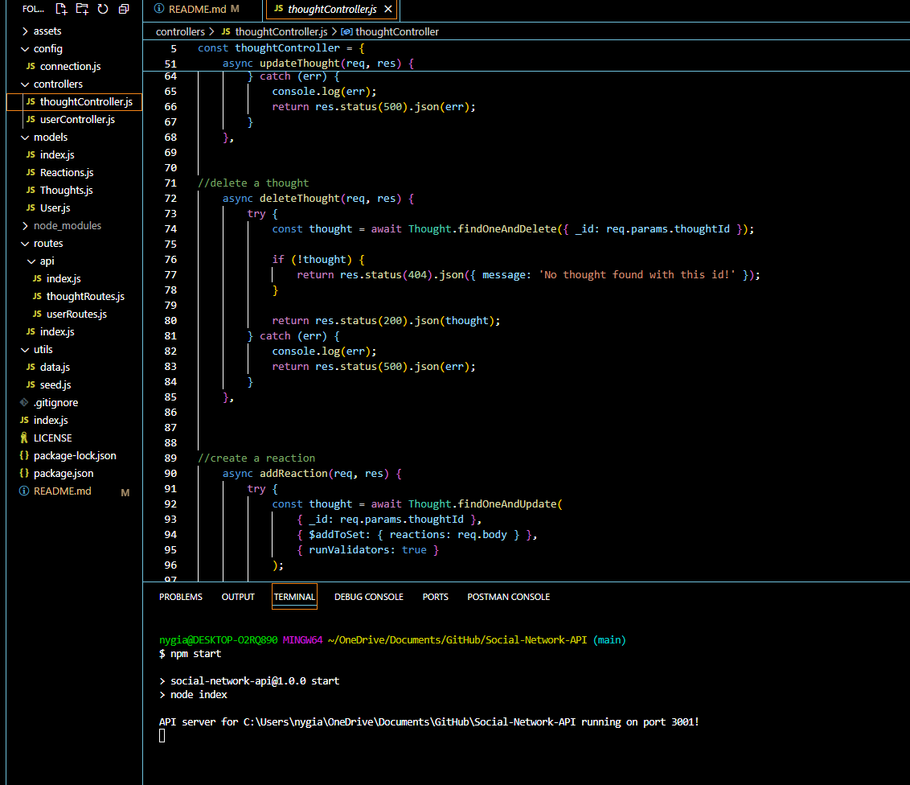
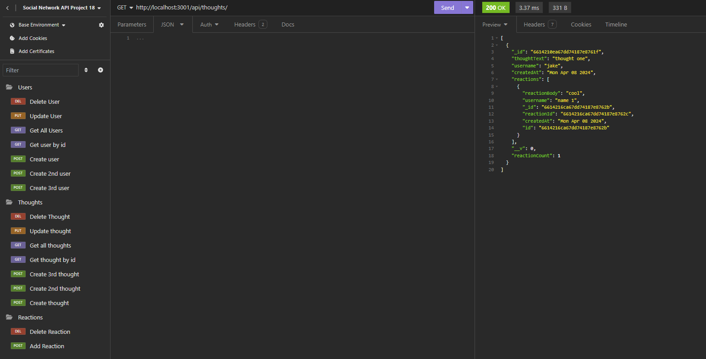

# Social-Network-API

## Video Link
[Video](https://drive.google.com/file/d/1dbpqkIZTwe5_5pnpa78XJ4kBU3-H9fEj/view)

## Screenshots

## Description
    - As a developer I wanted to be able to create a social network api using NoSQL
    - This project was built to have a large unstructured database for a social network app, the api can create,delete,update users, thoughts and reactions.
    - This project was able to solve how to build an api using mongoose for the database, building upon earlier concepts of api calls and routes, that allows the creation, deletion and updating of items within the database for a social network. 
    - This project taught me how build and adjust databases in NoSQL using mongoose and express.
    

## Installation
    To install this follow the link to the github repository below.
[Social Network API](https://github.com/Neglon/SVG-Logo-Creator)
Clone the files to you pc. Make sure that you are running node.js on your machine. 
[Node JS](https://nodejs.org/en)
Using a something like Virtual Studio Code, navigate to projects folder via the command line interface/terminal. Once inside, run 'npm install  to install the necessary packages. There should now be a packag-lock.json file and a node modules folder in addition to what was cloned. You are ready to run the program. 

## Usage
    Assuming you are still in the projects folder from installing the package you may run the program, type 'mpm start' into the CLI. Using insomnia you can then test different routes and see the database grow or adjust. Watch the video link above for insomnia testing.

## Updates
    This api still needs to have the delete reaction function work properly, currently it deletes the whole thought.
    In the Future it would also need a good seed packagage, add and delete friends as well.
   

## Credits
    N/A

## Liscence
    N/A

## Code Source
    Code fully written by Thomas Neylon, references were made to previous classwork, relying heavily on the mini project 18 and and the websites below.
    
(https://stackoverflow.com/questions/66197273/how-do-you-format-the-default-mongoose-date )
   
(https://stackoverflow.com/questions/70724966/how-to-use-getter-or-setter-with-mongoose-timestamps )

